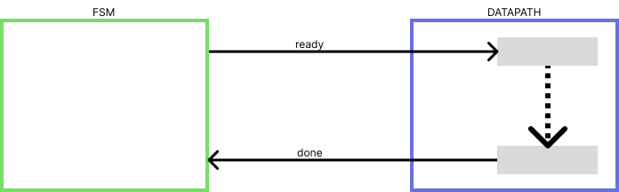
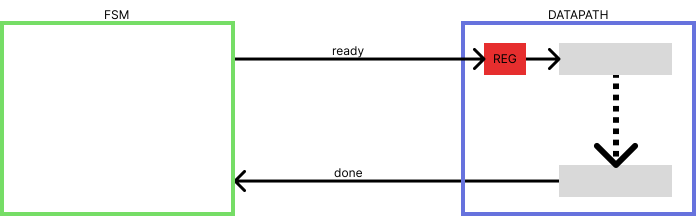

---
myst:
  html_meta:
    "description lang=en": "Errors and warnings in SIS and how to fix them. warning node does not fanout, network contains a cycle, must give F or R, but not both ..."
    "description lang=it": "Errori e warning in SIS e come risolverli. warning node does not fanout, network contains a cycle, must give F or R, but not both ..."
    "keywords": "betterSIS, SIS, BLIF, SIS errors, SIS warnings, fanout warning, network cycle error"
    "property=og:locale": "it_IT"
---

# Errori e Warning in SIS

Questo articolo contiene una lista di errori o warning che possono apparire utilizzando SIS (Sequential Interactive Synthesis).

In generale i **warning possono essere ignorati se le simulazioni danno i risultati attesi** 
mentre **gli errori devono essere risolti**.

Se le soluzioni indicate qua sotto non funzionano controllare se si sta utilizzando SIS versione 1.3.6 (non la 1.4) su un sistema operativo basato su Debian (come Ubuntu).
```{note}
SIS visualizza la sua versione quando viene eseguito
```

Ulteriori soluzioni "generiche" verranno elencate nella sezione "[Errore non in elenco](#errore-non-in-elenco)"

<br>

```{danger}


**!! MESSAGGIO IMPORTANTE per la persona che sta facendo troubleshooting !!**                


Per favore, se stai cercando la soluzione ad un errore che qui sotto non e' elencato e riesci a                        
trovare la soluzione per conto tuo crea una Github Issue con tutti i dettagli qui: [https://github.com/mario33881/betterSIS/issues](https://github.com/mario33881/betterSIS/issues)


Questo mi permettera' di aggiungere l'errore alla guida e 
chi si trovera' nella tua situazione potra' in futuro trovare velocemente e facilmente la soluzione al problema! 

Grazie.                                                                          
```

## Indice

Clicca su una delle voci per andare nella sezione relativa a quell'errore.

```{note}
Nei seguenti errori/warning vengono omesse parte dei messaggi che sono specifici al nome di model/input/output/nodi, numero di riga, ...
```

```{note}
Gli errori simili sono stati messi nella stessa sezione. Il nome usa ```/``` per separare gli errori
```

* [model already defined](#model-already-defined)

* [read_blif: no network found](#read-blif-no-network-found)

* [search file not found](#search-file-not-found)

* [.output / .input / .name](#output-input-name)

* [.end ... (null)](#end-null)
    ```{note}
    Dove "..." puo' essere il contenuto di una riga oppure parte di una keyword
    ```

* [X is output but Y already has function](#x-is-output-but-y-already-has-function)
    ```{note}
    Dove "X" e "Y" dipendono dai nomi delle variabili nel file blif
    ```

* [must give F or R, but not both](#must-give-f-or-r-but-not-both)

* [can't find model in files or library](#can-t-find-model-in-files-or-library)

* [calling subckt (contains `=')](#calling-subckt-contains)

* [Cyclic model dependency detected](#cyclic-model-dependency-detected)

* [warning input does not fanout / warning node does not fanout](#warning-input-does-not-fanout-warning-node-does-not-fanout)

* [warning node is not driven](#warning-node-is-not-driven)

* [network contains a cycle](#network-contains-a-cycle)

* [Nessuno degli errori elencati qui sopra](#errore-non-in-elenco)


---

(model-already-defined)=
## model already defined

L'errore indica che e' stata utilizzata la stessa stringa per specificare il nome del modello/componente nel file o nei file importati utilizzando la keyword ```.search```:

Esempio:

```
.model mycomponent
.inputs a b
.outputs o
.names a b o
11 1
.end

.model mycomponent
.inputs c d
.outputs z
01 1
.end
```

Per risolvere il problema occorre scegliere nomi univoci per i ```.model```


---

(read-blif-no-network-found)=
## read_blif: no network found

Si e' eseguito il comando ```read_blif``` su un file che e' vuoto o che non contiene la descrizione del circuito.


Esempio con filevuoto vuoto:

```
read_blif filevuoto.txt
```

Controllare di leggere il file corretto e se il file contiene la descrizione del circuito che si desidera simulare/sintetizzare.


```{note}
NOTA: questo errore appare anche se un file importa un file che e' vuoto o che non contiene circuiti nel formato .blif
```


Esempio con un file che cerca di importare un file vuoto:

```
.model mycircuit
.inputs a b
.outputs o

# tutto sembra corretto... EPPURE...
# filevuoto.blif e' vuoto...
.search filevuoto.blif

.names a b o
11 1
.end
```


---

(search-file-not-found)=
## search file not found

Il file letto contiene una keyword ```.search``` che cerca  di importare un file non esistente.

```{note}
Questo problema appare anche se si importa un file che cerca di importare un file non esistente, oppure quando un file importa file che importano file che non esistono... eccetera....
```

---

(output-input-name)=
## .output / .input / .name

Questo messaggio (preceduto dal numero di riga e dal nome del file) appare perche' si e' sbagliato a scrivere la keyword ```.inputs``` o ```.outputs``` o ```.names``` : manca la ```"s"``` !


---

(end-null)=
## .end ... (null)
Questo warning puo' essere risolto
aggiungendo una riga vuota sotto alla riga
che viene visualizzata da SIS.

La causa, probabilmente, e' 
l'aver scritto il file su un sistema
Windows e poi aver copiato il file
su un sistema GNU/Linux su cui si e' eseguito SIS (questo puo' capitare ad esempio se si lavora su un cartella condivisa tra un host Windows e una macchina virtuale Linux).

I sistemi operativi identificano i caratteri
di newline in maniera diversa.

Forse e' possibile risolvere semplicemente lavorando direttamente su Linux... Questa pero' e' SOLO una teoria: potrebbe essere sbagliata.

Una cosa e' sicura: aggiungere una riga vuota sotto
alla riga che crea il messaggio di warning risolve il problema...

Esempi di messaggio:
```
# nella riga <riga_file> c'e' l'istruzione .subckt:
# aggiungere una riga vuota dopo quella riga rimuove
# il messaggio
<file>, line <riga_file> .endckt (null)

# --------------------------------------------------
# nella riga <riga_file> c'e' l'istruzione .end:
# aggiungere una riga vuota dopo quella riga rimuove
# il messaggio
<file>, line <riga_file> .endes (null)

```


---

(x-is-output-but-y-already-has-function)=
## X is output but Y already has function
Questo errore appare perche' un output
e' stato definito piu' volte.

Esempio:
```
.model mycircuit
.inputs a b
.outputs e

.search circuit2.blif

# problema: sto definendo 'e' qui
.subckt circuit2 param=b out=e

# e anche qui
.names a e
1 1
.end
```


---

(must-give-f-or-r-but-not-both)=
## must give F or R, but not both

Questo errore appare perche' si e' definita una tabella di verita' sia con mintermini sia con maxtermini.

Esempio:

```
.model or
.inputs a b
.outputs o

.names a b o
00 0
01 1
10 1
11 1

.end
```

Il problema e' l'aver definito ```"00 0"``` e ```"[...] 1"``` contemporaneamente.

Per risolvere il problema indicare SOLO mintermini (1 come output) oppure SOLO i maxtermini (0 come output)

SOLUZIONE CON MINTERMINI:

```
.model or
.inputs a b
.outputs o

# specifico solo gli output a 1
.names a b o
01 1
10 1
11 1

.end
```

SOLUZIONE CON MAXTERMINI:

```
.model or
.inputs a b
.outputs o

# specifico solo gli output a 0
.names a b o
00 0

.end
```


---

(can-t-find-model-in-files-or-library)=
## can't find model in files or library

Questo errore appare perche' si sta cercando
di utilizzare un modello non definito con la keyword ```.subckt```

Esempio:
```
.model mycircuit
.inputs a
.outputs o

.search file.blif

# doesntexist non e' definito da nessuna parte
.subckt doesntexist b=a c=o

.end
```

Per sistemare il problema:
* controllare di aver scritto correttamente il nome del modello da importare oppure
* controllare di aver scritto correttamente il nome del modello importato

Controllare per sicurezza di non aver ottenuto contemporaneamente anche l'errore ```calling subckt (contains `=')```:
in quel caso controllare come sistemare quel problema [cliccando qui](#calling-subckt-contains)
e l'errore "can't find model in files or library" potrebbe "scomparire".


---

(calling-subckt-contains)=
## calling subckt (contains `=')

Questo errore puo' apparire subito prima dell'errore ```can't find model in files or library```:
significa che molto probabilmente ci si e' dimenticati di specificare
il nome del modello da importare con la keyword ```.subckt```.

```{note}
Un'altra possibilita' (meno probabile) e' aver utilizzato "=" nel nome
di un modello. 

Questo non e' permesso: modificare il nome del modello per risolvere il problema.
```

Esempio:
```
.model mycircuit
.inputs a
.outputs o

.search file.blif

# manca il nome... oppure il nome contiene = (simbolo di uguale)
# che e' un carattere non accettato
.subckt a=b out=o
.end
```


---

(cyclic-model-dependency-detected)=
## Cyclic model dependency detected
Questo errore si verifica quando un modello cerca
di importare se stesso utilizzando la keyword ```.subckt```

Esempio:
```
.model mycircuit
.inputs a
.outputs b

# sto importando mycircuit dentro a mycircuit,
# creando un "ciclo di dipendenze"
.subckt mycircuit

.names a b
11
.end
```
Per risolvere il problema modificare il nome del modello importato
e sostituirlo con il nome corretto.


---

(warning-input-does-not-fanout-warning-node-does-not-fanout)=
## warning input does not fanout / warning node does not fanout

Questo tipicamente NON e' un errore: e' un warning.

Warning significa che POTREBBERO esserci problemi.
Verificare l'output del circuito: se e' corretto molto probabilmente e' possibile ignorare questo messaggio.

Per sicurezza e' possibile verificare qua sotto il motivo per cui appare e agire di conseguenza.

Questo warning appare quando:

* vengono utilizzate delle keyword andando a capo con la ```"\"```
  
  ```{note}
  Questo spesso accade perche' SIS lo fa in automatico sui file durante le ottimizzazioni
  ```

  Esempio:
  
  ```
  .model mycircuit
  .inputs in1 in2 in3 \
  in4 in 5
  ```
  
  In questo caso e' possibile ignorare tranquillamente il warning se la simulazione del circuito da il risultato atteso.

* non vengono utilizzati tutti i nodi specificati nel file.
  
  Questo puo' avvenire per diversi motivi:
  
  * Errore di distrazione: ci si dimentica di completare la descrizione di un componente.
    
    Per correggere il problema basta completare il componente modificando il file ```.blif```.
  
  * Errore di scrittura: si dimentica o si sbaglia una lettera o un numero.
    
    Esempio:
    
    ```
    .model mycircuit
    .inputs in1 in0
    .outputs o
    .names in1 in o
    00 1
    .end
    ```
    
    Nell'esempio il problema e' l'aver dimenticato lo "0" in in0.
    
    SIS dira' che l'input "in0" non e' utilizzato.
    
    Per correggere il problema ricontrollare i nomi degli input sia della keyword ```.inputs``` sia quelli utilizzati nei ```.names```.
  
  * L'input non deve o non puo' essere utilizzato.
    
    Questo e' il caso in cui il warning NON puo' essere rimosso ma non ci sono problemi ad ignorarlo se la simulazione da il risultato desiderato.    
    
    Questo avviene ad esempio nelle FSM perche' il nome degli input non viene mai utilizzato all'interno del file: gli input usati tra ```.start_kiss``` e ```.end_kiss``` vengono riconosciuti automaticamente da SIS ma il warning appare lo stesso.
    
    Esempio:
    
    ```
    .model mycircuit
    .inputs a b
    .outputs o
    
    .start_kiss
    # notare che i nomi degli input in .inputs non vengono
    # mai utilizzati esplicitamente nel file: questo e' un utilizzo corretto di SIS
    # eppure SIS visualizzera' comunque il messaggio di warning
    .i 2
    .o 1
    .s 2
    .p 2
    .r A
    
    00 A B 0
    01 B A 1
    
    .end_kiss
    .end
    ```
    
    Un altro caso in cui appare questo warning e' quando non si usa un input perche' non c'e' motivo per utilizzarlo:
    
    un esempio concreto e' la creazione di un sottrattore a 8 bit utilizzando piu' sommatori e negando il secondo ingresso:
    
    l'ultimo riporto non e' utile al risultato e ignorarlo porta alla visualizzazione del warning.

    Anche in questo caso e' possibile ignorare il warning.

---

(warning-node-is-not-driven)=
## warning node is not driven

Questo warning, al contrario dei warning ```warning input does not fanout``` / ```warning node does not fanout```, e' tipicamente grave.

Il warning appare perche' un input non e' controllato da niente: significa che il suo valore non e' definito ne da output di altri componenti ne dalla keyword ```.inputs```

Esempio:

```
.model mycircuit
.inputs a b
.outputs o

# c non e' definito da nessuna parte:
# SIS lo mette a "0" di default,
# cosa che al 99% non e' desiderata
.names a b c o
001 1

.end
```


---

(network-contains-a-cycle)=
## network contains a cycle

SIS rileva che un ciclo/loop e' presente nel circuito:

l'output di un componente rientra all'ingresso del componente stesso.

Per risolvere il problema:

* Verificare se tutte le connessioni sono state effettuate correttamente tra i componenti (se i nomi degli input e degli output dei vari componenti sono corretti)

* Se l'errore appare su un file in cui si cerca di creare una FSMD facendo comunicare datapath e FSM occorre aggiungere un latch all'interno del datapath.
    ```{note}
    La posizione ideale probabilmente e' sul segnale che "avvia" il datapath
    ```
  
  Immagine che rappresenta la situazione in cui appare l'errore "network contains a cycle":

  

  Immagine con risoluzione dell'errore:
  
  

  ```{note}
  Per risolvere il problema si aggiunge un latch/registro nel datapath che prende in input il segnale proveniente dalla FSM (che in questo caso e' chiamato "ready"). 
  
  L'output del latch fara' eseguire la parte di calcolo del datapath.
  ```

  Esempio di applicazione ([Elaborato SIS architettura degli elaboratori, anno 2020-2021](https://github.com/arc6-202021/lib_componenti_sis)):
  
  ```{note}
  In questo caso il segnale proveniente dalla FSM in input al datapath si chiama "CHECK_DISPONIBILITA".
  Il segnale viene mandato in input ad un latch e il suo output ("CHECK_DISPONIBILITA_IN") viene utilizzato per consentire la lettura dei dati provenienti dall'esterno del datapath mediante i multiplexer.

  Rimuovendo il latch ed utilizzando direttamente il segnale "CHECK_DISPONIBILITA" per controllare i multiplexer si avrebbe l'errore "network contains a cycle".
  ```

---

(errore-non-in-elenco)=
## Errore non in elenco

Se le soluzioni indicate in questa pagina non funzionano:

1. Controllare se si sta utilizzando SIS versione 1.3.6 (non la 1.4) su un sistema operativo basato su Debian (come Ubuntu).

    ```{note}
    SIS visualizza la sua versione quando viene eseguito
    ```

    In caso contrario (versione di SIS e/o sistema operativo diversi) provare a vedere se il problema si presenta anche nell'"ambiente ideale" per SIS.

2. Un altro possibile problema potrebbe essere la compatibilita'
tra file Windows e Linux (ad esempio se si sta scrivendo i file BLIF su Windows e Linux e' su una macchina virtuale):

    Provare ad utilizzare il programma ```dos2unix``` per convertire i file Windows in file Unix.
    ```{note}
    Per essere precisi: non esiste un file "Windows" e un file "Unix",
    ma esistono codifiche diverse per indicare il carattere di fine riga.

    Windows usa "\r\n" (carriage return e line feed) mentre Unix usa "\n" (line feed).

    "\r" ha un significato storico che ha a che fare con la testina
    delle stampanti e delle macchine da scrivere che deve essere spostata
    a inizio riga oltre che a capo riga con il carattere "\n" per poter
    scrivere all'inizio di una nuova riga.

    Molti editor di testo e programmi moderni riescono a fare una conversione
    automatica, trasparente da parte dell'utente, riconoscendo il "\r\n" e interpretandolo come "\n"
    ma il "formato"  in cui il file viene salvato dipende da come si configura
    lo "strumento" di scrittura del file.
    ```

    Installare dos2unix con il comando:

    ```
    sudo apt-get install dos2unix
    ```

    Eseguire dos2unix sui file:
    ```
    dos2unix <nome_file>
    ```
    ```{note}
    Dove ```<nome_file>``` e' da sostituire con il nome del file
    ```

    Se si vuole eseguire dos2unix su piu' file utilizzare l'asterisco:
    ```
    dos2unix *
    ```
    ```{note}
    Esegue dos2unix su tutti i file nella cartella corrente
    ```

<div align=center>

[🢠 Syntax Highlighting per file BLIF](./006_syntax_highlight.md) &nbsp; | &nbsp; [Documentazione SIS online 🢡 ](./008_documentazione_sis.md)

[🗎 Torna all'indice](./tutorials.md)

</div>